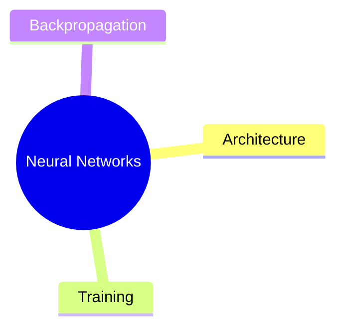

# 🧠 Av Notes AI: Video to Notes Pipeline

This pipeline automatically converts educational video and audio lectures into comprehensive study materials. By leveraging state-of-the-art AI models, it transcribes media, extracts key concepts, and generates structured Notes, Flashcards, and interactive Mindmaps—finally exporting everything into a neat `.docx` file.

## ✨ Features

*   **Fast Transcription:** Uses `faster-whisper` (Distil-Large V3) for rapid, accurate, and multi-lingual audio-to-text conversion.
*   **Intelligent Summarization:** Utilizes quantized Large Language Models (Gemma) to deeply analyze the text.
*   **Three Output Modes:**
    *   📝 **Notes:** Bulleted summaries of core and minor concepts.
    *   📇 **Flashcards:** Q&A JSON format for active recall studying.
    *   🗺️ **Mindmaps:** Generates Mermaid.js syntax and renders visual mindmaps directly in the notebook.
*   **Dual-GPU Optimized:** Intelligently routes the audio model to GPU 0 and the LLM to GPU 1 for parallel efficiency without memory bottlenecks.
*   **Word Document Export:** Automatically compiles all generated resources into an easy-to-share `Submission.docx` file.

## 🛠️ Tech Stack

*   **Audio Processing:** [Faster-Whisper](https://github.com/SYSTRAN/faster-whisper)
*   **LLM Pipeline:** HuggingFace `transformers`, `pipeline`
*   **Memory Optimization:** `accelerate`, `bitsandbytes` (4-bit quantization)
*   **Visualizations:** Mermaid.js (via `mermaid.ink` API)
*   **Document Generation:** `python-docx`

## 🚀 Getting Started

### Prerequisites
This codebase is optimized for a **Dual-GPU environment** (e.g., Kaggle Notebooks with T4x2).

### Installation

1. Clone the repository:
   ```bash
   git clone [https://github.com/yourusername/ai-study-buddy.git](https://github.com/yourusername/ai-study-buddy.git)
   cd ai-study-buddy
   ```

---

## Install Required Packages

```bash
pip install -U transformers accelerate bitsandbytes
pip install faster-whisper
pip install python-docx
```

---

# Step-by-Step Deployment

## 1. Clone the Repository

```bash
git clone https://github.com/yourusername/ai-study-buddy.git
cd ai-study-buddy
```

---

## 2. Install Required Environment Packages

```bash
pip install -U transformers accelerate bitsandbytes faster-whisper python-docx
```

---

## 3. Configure Your Input Paths

Open the notebook script and point the execution path to your target video or audio recordings:

```python
audio_files = ["/your/path/to/lecture_file.mp4"]
```

---

## 4. Execute the Pipeline

Run the notebook cells sequentially.

Once completed, the system generates:

- AI Notes
- Flashcards
- Mermaid Mindmaps
- `Submission.docx`

inside the output directory.

---

# Example Output

## Notes

```text
- Neural networks are inspired by biological neurons.
- Backpropagation minimizes prediction error.
- Gradient descent updates model weights.
```

---

## Flashcards

```json
[
  {
    "q": "What is backpropagation?",
    "a": "A learning algorithm used to optimize neural network weights."
  }
]
```

---

## Mermaid Mindmap



---

# Memory Management Protocols

Processing multiple deep learning transformers locally can heavily drain GPU memory and system resources.

This project integrates an active `clear_vram()` protocol that:

- Forces Python garbage collection cycles using:
  
```python
gc.collect()
```

- Clears PyTorch CUDA cache using:

```python
torch.cuda.empty_cache()
```

- Cleans inter-process GPU memory allocation using:

```python
torch.cuda.ipc_collect()
```

This prevents:
- CUDA Out-of-Memory errors
- Memory fragmentation
- Runtime crashes during iterative inference

---

# GPU Optimization Techniques

## 4-Bit Quantization

Gemma is loaded using BitsAndBytes 4-bit quantization:

```python
load_in_4bit=True
```

Benefits:
- Lower VRAM usage
- Faster inference
- Ability to run larger models on smaller GPUs

---

## Multi-GPU Distribution

The project separates workloads across GPUs:

| GPU | Task |
|------|------|
| GPU 0 | Whisper ASR |
| GPU 1 | Gemma LLM |

This improves:
- Throughput
- Memory balancing
- Parallel inference efficiency

---

# Current Limitations

- Long lectures may still require aggressive chunking
- Mindmap generation depends on LLM consistency
- Sequential chunk processing increases runtime
- Flashcard JSON parsing may occasionally fail

---

# Future Improvements

## Planned Features

- RAG-based retrieval pipeline
- Streamlit / Gradio frontend
- Timestamped summaries
- Quiz generation
- OCR support for slides
- Speaker diarization
- Vector database integration
- Real-time lecture summarization
- Parallel chunk processing
- Automatic Anki deck export

---

# Suggested Improvements for Contributors

You can contribute by:

- Improving prompt engineering
- Adding semantic chunking
- Building a frontend dashboard
- Creating a single-GPU fallback pipeline
- Optimizing inference speed
- Adding evaluation metrics

---

# Contributing

Contributions are welcome.

If you want to optimize the NLP pipeline, improve memory efficiency, add frontend support, or integrate advanced retrieval systems, feel free to fork the repository and submit a Pull Request.

---

# Repository Structure

```text
ai-study-buddy/
│
├── notebooks/
│   └── lecture_pipeline.ipynb
│
├── outputs/
│   └── Submission.docx
│
├── assets/
│   └── sample_mindmaps/
│
├── requirements.txt
├── README.md
└── LICENSE
```

---
audio_files = ["/your/path/to/lecture_file.mp4"]
   Here is a clean, structured, and professional `README.md` file designed for your GitHub repository. It clearly explains your architecture, project scope, and setup instructions, making it ready for production or academic presentation.

***
```markdown
# 🧠 AI Study Buddy: Automated Video-to-Notes Pipeline

An automated AI pipeline that processes educational lecture videos or audio files to generate comprehensive, structured study materials. By leveraging a dual-GPU pipeline, the system transcribes multi-lingual media, extracts core concepts, and compiles organized **Study Notes**, **Active Recall Flashcards**, and interactive **Mermaid.js Mindmaps** into a ready-to-download Microsoft Word (`.docx`) report.

---

# 🚀 System Architecture & Workflow

The pipeline is optimized for **Dual-GPU execution** (e.g., Kaggle's T4 x2 environment) to run heavy model pipelines concurrently without memory or performance bottlenecks:

```mermaid
graph TD
    A[Input Lecture Video/Audio] --> B[GPU 0: Faster-Whisper distil-large-v3]
    B --> C[Raw Text Transcript]
    C --> D[Semantic Chunking Engine]
    D --> E[GPU 1: Quantized Gemma LLM]
    
    E --> F1[📝 Notes Generation]
    E --> F2[📇 Flashcards JSON]
    E --> F3[🗺️ Mermaid Mindmap]
    
    F1 --> G[Document Aggregator python-docx]
    F2 --> G
    F3 --> G
    
    G --> H[📦 Submission.docx Output]
---
# GitHub Topics

```text
ai
llm
whisper
gemma
transformers
speech-recognition
generative-ai
education
machine-learning
deep-learning
nlp
huggingface
python
rag
```

---

# License

This project is open-source and licensed under the MIT License.

---

# Acknowledgements

- OpenAI Whisper
- Google Gemma
- HuggingFace Transformers
- Faster-Whisper
- Mermaid.js
- PyTorch
